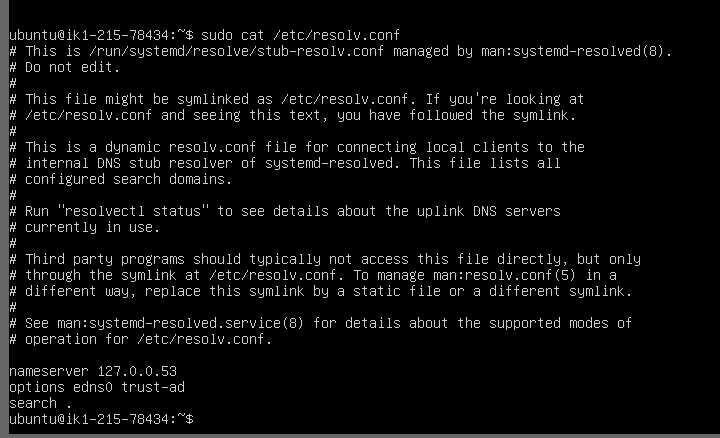
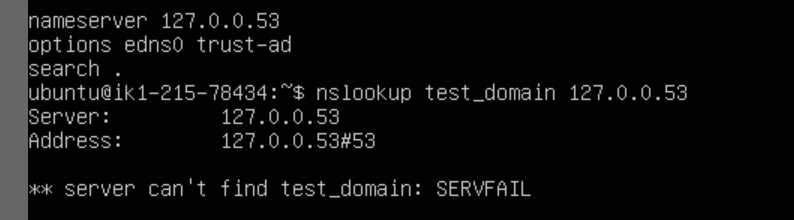

# Apacheのインストールについて
## 手順

https://elec-hobby.com/vps-vol-03-apache/ <br>
https://www.digitalocean.com/community/tutorials/how-to-install-the-apache-web-server-on-ubuntu-20-04-ja
<br>
を参考に順序通り実行(内容ほぼ同じ)<br>　　

## 作成したドメイン

test_domain<br>
hogehoge.jp(ダメ元で再度test_domainと同様の手順で作成)<br>

## Apacheでテスト用ドメインを作成しVirtualHostを起動
### 問題発生

ドメイン名でアクセスできない(未解決)<br>　

### 現象
IPアドレス(http://153.120.41.188 )ではアクセスできて，index.htmlは正常に表示される<br>  
しかし，ドメイン名(http://test_domain)では「アクセスしようとしているサイトを見つけられません」と表示される<br>

### 試してみたこと
(1)
VirtualHostをIPアドレスベースにした<br>
(信頼性の問題などでApacheが.confファイルを読み込むときにDNSを使用しないような設定にするため)<br>
```
sudo nano /etc/apache2/sites-available/test_domain.conf
```
で以下のように編集
```
<VirtualHost 153.120.41.188>
```
→変化なし<br>
参考：https://httpd.apache.org/docs/2.4/ja/dns-caveats.html<br>

(2)
調べるとDNSの設定の問題の可能性が高いので，DNSサーバの設定を確認した<br>　　
```
sudo cat /etc/resolv.conf
```
を実行すると次のような出力があった
<br>
<a id="ps"></a>


本来，searchやdomainの項目に作成したドメイン(test_domain,hogehoge.jp)があることを期待したが，<br>
domain名がそもそも登録されていないことが分かった<br>
<br>

(理想は↓のような表示)<br>


あと，DNSサーバのIPアドレスが分かった<br>

(3)
DNSサーバに名前解決を問い合わせた<br>

```
nslookup test_domain 127.0.0.53
```
を実行すると次のような出力があった
<br>



やっぱりtest_domainはなかった<br>

## 原因判明

**そもそもDNSサーバにドメインが登録されていない**<br>
([元のサイト](https://elec-hobby.com/vps-vol-03-apache/)の手順ではDNSサーバの設定はないがdomainで表示されることになっている)<br>

今回はここまでです。<br>

## 今後

DNSサーバにドメインとIPアドレスを登録する（？）<br>
DNSサーバ設定を行う/etc/resolv.confは[編集するなと書いてある](#ps)のでどのような手段があるかはこれから調べます。<br>


## その他躓いたところ
### 文字化け
インストール成功後，
```
sudo ufw allow 'Apache'
```
を実行すると文字化けして出力が読めず。<br>　　
→[解決済]()

## 参考になったサイト
https://linuc.org/study/knowledge/507/<br>
https://xtech.nikkei.com/it/article/COLUMN/20061031/252340/<br>
https://itc.tokyo/apache/set-up-multiple-domains/<br>
https://www.javadrive.jp/apache/ini/index11.html<br>


